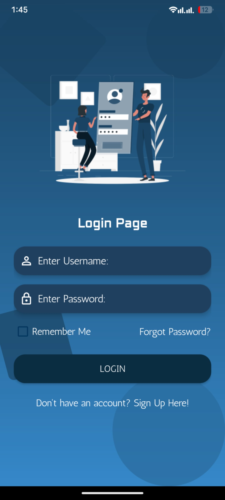
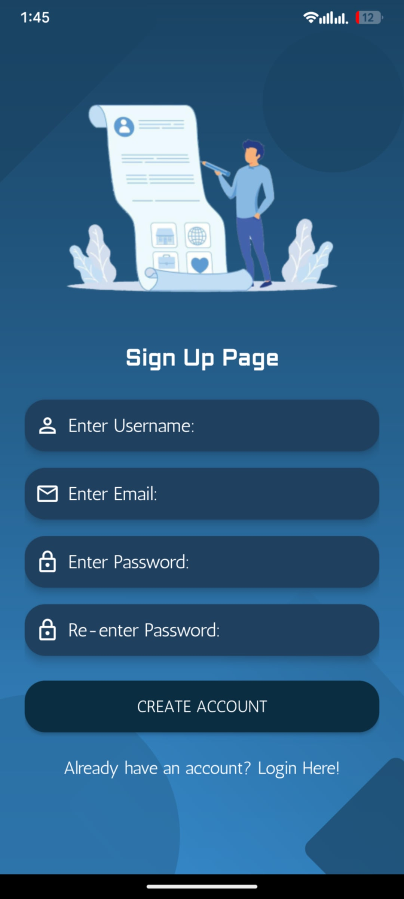
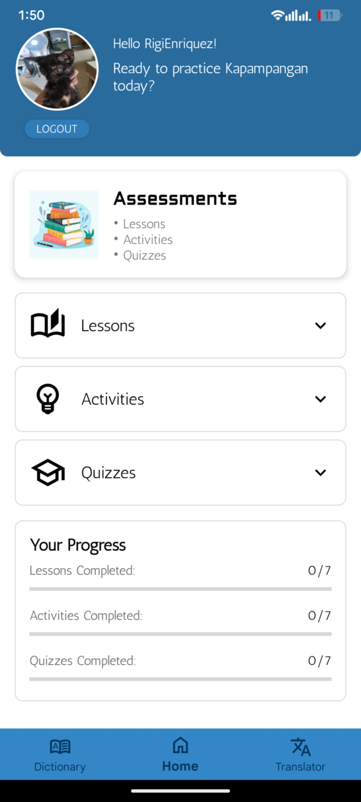
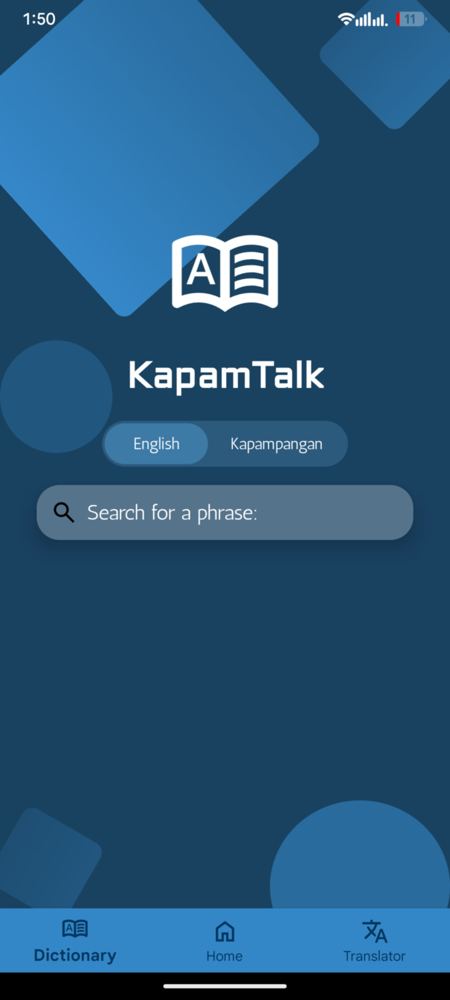
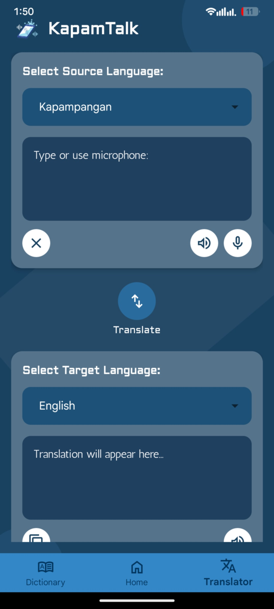

# KapamTalk

**Description:**  
KapamTalk is a mobile Learning Management System (LMS) designed to help learners study the Kapampangan language. It features speech recognition to improve pronunciation, interactive lessons, and learning tools that make language acquisition more engaging and effective.  

**Developers:**  
- RigiEnriquez
- RomerRamos
- YceLopez 

---

## Features
- 📖 **Kapampangan Lessons** – Learn vocabulary, grammar, and common phrases.  
- 🎙 **Speech Recognition** – Practice pronunciation with real-time feedback.  
- 📝 **Assessments & Quizzes** – Test your knowledge and track progress.  
- 📊 **Dashboard** – Monitor learning activities and scores.  
- 📚 **Dictionary** – Quickly look up Kapampangan words and meanings.  

---

## How to Use
1. Sign up or log in to your KapamTalk account.  
2. Select your lesson or module from the dashboard.  
3. Practice speaking Kapampangan using the speech recognition feature.  
4. Complete quizzes and track your scores.  
5. Use the dictionary for additional learning support.  

---

## Screenshots

  
*Login screen of KapamTalk.*  

  
*Sign Up screen of KapamTalk.* 

  
*Dashboard with learning modules.*  

  
*Dictionary screen of KapamTalk.*  

  
*Translator screen of KapamTalk.* 

## Installation

### 📱 Option 1: Install from APK
1. Download the latest release from the [Releases page](https://github.com/RigiEnriquez/KapamTalk/releases).  
2. Locate the downloaded `KapamTalk.apk` on your Android device.  
3. If prompted, enable **Install from Unknown Sources** in your device settings.  
4. Tap the APK file to install KapamTalk.  

### 💻 Option 2: Build from Source
1. Clone this repository:  
   ```bash
   git clone https://github.com/RigiEnriquez/KapamTalk.git
2. Open the project in Android Studio.
3. Let Android Studio download the required Gradle dependencies.
4. Connect an Android device (with USB debugging enabled) or launch an emulator.
5. Click Run ▶ in Android Studio to build and install the app.
